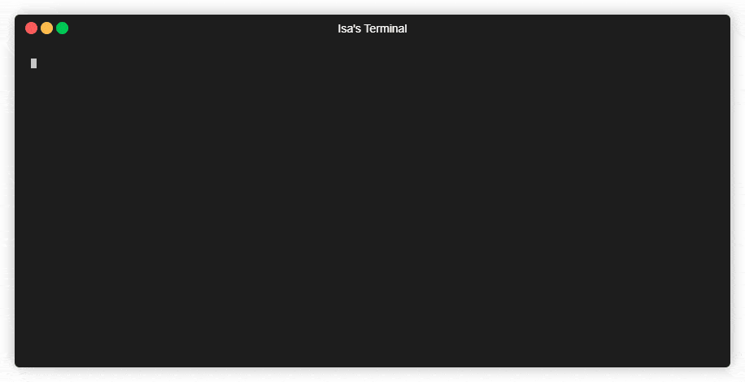

# PHP Spinner

> Elegant spinner for interactive CLI apps.
> 
> Alternative for https://github.com/sindresorhus/elegant-spinner



---

````php
$result = \IsaEken\Spinner\Spinner::run(function () {
    \IsaEken\Spinner\Spinner::setTitle('Calculating...');
    $a = 1;
    $b = 2;
    $c = $a + $b;
    \IsaEken\Spinner\Spinner::setTitle('Waiting...');
    sleep($c);
    return $c;
});

echo "The result is: $result!";
````

## Installation

You can install using compoer.

````shell
composer require isaeken/spinner
````

## License

The MIT License (MIT). Please see [License File](LICENSE.md) for more information.
